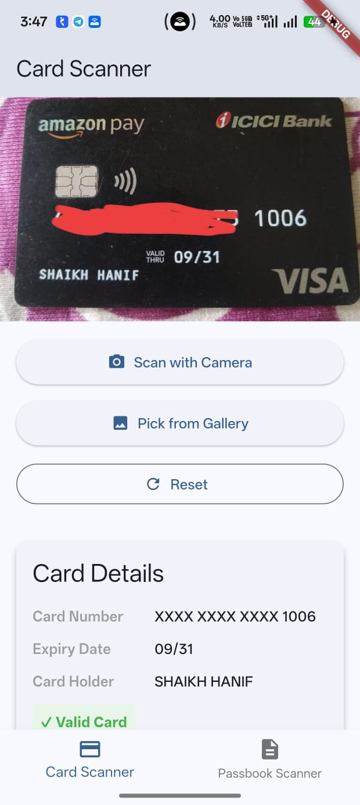
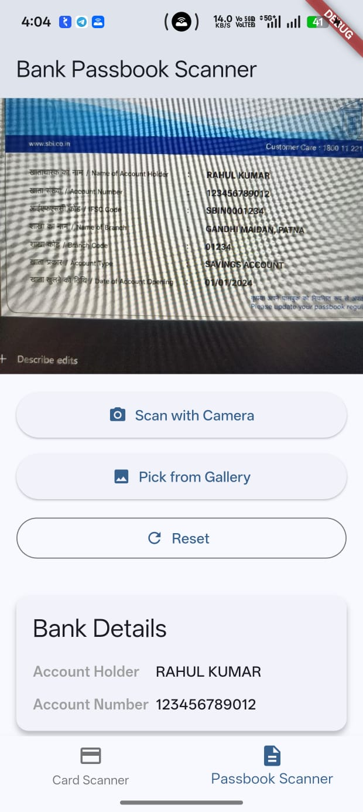

# Data Extractor Scanner

A Flutter mobile application that scans and extracts structured data from physical credit/debit cards and bank passbooks using OCR (Google ML Kit) and custom parsing logic.

## Screenshots

| Card Scanner | Passbook Scanner |
| :---: | :---: |
|  |  |

## Architecture

This project follows **MVVM (Model-View-ViewModel)** architecture with **Riverpod** for state management.

### Project Structure

```
lib/
├── main.dart                          # App entry point with ProviderScope
├── models/
│   ├── card_details.dart              # Card data model
│   └── bank_details.dart              # Bank account data model
├── services/
│   ├── parsing_service.dart           # Core parsing algorithms (Card, Passbook, Luhn)
│   └── ocr_service.dart               # OCR integration with image picker
├── view_models/
│   ├── card_scanner_viewmodel.dart    # Card scanner state management
│   └── passbook_scanner_viewmodel.dart # Passbook scanner state management
├── views/
│   ├── home_screen.dart               # Main navigation screen
│   ├── card_scanner_screen.dart       # Card scanning UI
│   └── passbook_scanner_screen.dart   # Passbook scanning UI
└── widgets/
    ├── card_details_display.dart      # Card details display widget
    └── bank_details_display.dart      # Bank details display widget
```

## Features

### 1. Card Scanner
- Open camera or pick from gallery
- Extract card number, expiry date, and cardholder name
- Validate card using Luhn algorithm
- Display masked card number (XXXX XXXX XXXX 1234)
- Show validity status

### 2. Passbook Scanner
- Open camera or pick from gallery
- Extract account holder name, account number, and IFSC code
- Display structured bank account information
- Handle multiple account numbers intelligently

## Core Algorithms

### 1. Luhn Algorithm (`isValidCard`)
- Validates 13-19 digit card numbers
- Handles various card formats (spaces, dashes)
- Implements standard Luhn checksum validation

### 2. Card Parser (`parseCard`)
- Extracts card number with regex patterns handling multiple formats
- Detects expiry dates in MM/YY, MM-YY, and MMYY formats
- Extracts cardholder name from uppercase sequences
- Handles OCR misreads (O→0, I→1, S→5, B→8)
- Returns validated CardDetails object

### 3. Passbook Parser (`parsePassbook`)
- Extracts account number (9-18 digits) intelligently
- Detects IFSC code pattern (4 letters + 0 + 4 alphanumeric)
- Extracts account holder name (longest alphabetic sequence)
- Filters out date and phone number false positives
- Returns structured BankDetails object

## State Management with Riverpod

- **CardScannerNotifier**: Manages card scanning state
- **PassbookScannerNotifier**: Manages passbook scanning state
- **ocrServiceProvider**: Singleton OCR service provider
- Reactive UI updates on state changes

## Libraries Used

- **flutter_riverpod**: State management (v2.4.0)
- **camera**: Camera access (v0.10.5)
- **image_picker**: Image selection from camera/gallery (v1.0.0)
- **google_mlkit_text_recognition**: OCR text extraction (v0.8.0)
- **permission_handler**: Runtime permission management (v11.4.0)

## Setup Instructions

### Prerequisites
- Flutter SDK 3.12.0 or higher
- Android SDK (for Android build)
- Xcode (for iOS build - optional)

### Installation

1. Clone the repository:
```bash
git clone <repository-url>
cd data_extractor_scanner
```

2. Install dependencies:
```bash
flutter pub get
```

3. Run the app:
```bash
flutter run
```

### Android Setup
- Permissions are already configured in `AndroidManifest.xml`
- Runtime permissions are handled via permission_handler package
- Uses Google ML Kit for text recognition

### iOS Setup (Optional)
Add the following to `ios/Runner/Info.plist`:
```xml
<key>NSCameraUsageDescription</key>
<string>Camera access is required to scan cards and passbooks</string>
<key>NSPhotoLibraryUsageDescription</key>
<string>Photo library access is required to select images</string>
```

## Running Tests

Run all tests:
```bash
flutter test
```

Run specific test file:
```bash
flutter test test/luhn_algorithm_test.dart
flutter test test/card_parser_test.dart
flutter test test/passbook_parser_test.dart
```

### Test Coverage

- **Luhn Algorithm Tests** (10 tests)
  - Valid cards (Visa, MasterCard, with spaces/dashes)
  - Invalid cards and edge cases
  
- **Card Parser Tests** (12 tests)
  - Card number extraction (various formats)
  - Expiry date detection (MM/YY, MM-YY, MMYY)
  - Cardholder name extraction
  - OCR misread handling
  - Card validation

- **Passbook Parser Tests** (11 tests)
  - Account holder name extraction
  - Account number detection
  - IFSC code identification
  - Multiple number filtering
  - OCR error handling

## Key Features & Edge Cases Handled

### OCR Noise Handling
- O → 0 (letter O to digit zero)
- I/l → 1 (letter I/l to digit one)
- S → 5 (letter S to digit five)
- B → 8 (letter B to digit eight)

### Card Parsing
- Multiple card number formats (with/without spaces/dashes)
- Inconsistent spacing between digits
- Various expiry date formats
- Missing cardholder name
- Invalid card number detection via Luhn

### Passbook Parsing
- Multiple numbers in text (picks 9-18 digit account number)
- Distinguishes account numbers from dates/phone numbers
- IFSC pattern detection
- Longest name sequence as account holder
- Handles "Account Number:" labels

### Error Handling
- Empty text input
- Blurry/partial scans
- No data found in image
- Duplicate/invalid scans
- Missing required fields
- Runtime permission failures

## Assumptions

1. **Card Format**: Standard 13-19 digit credit/debit card numbers
2. **Expiry Date**: In MM/YY, MM-YY, or MMYY format on the card
3. **Account Number**: 9-18 digits, typically near account holder name
4. **IFSC Code**: 4 letters + 0 + 4 alphanumeric characters (Indian format)
5. **Name Format**: Uppercase on physical cards, may contain spaces
6. **Image Quality**: Reasonably clear for text recognition
7. **No Backend**: All processing happens on device

## What Was Skipped & Why

### Not Implemented
1. **Backend API Integration**: Assignment specifies client-side only
2. **Pre-parsing Libraries**: Requirement mandates manual parsing implementation
3. **Database Storage**: Focus on real-time extraction, not persistence
4. **Advanced UI Animations**: Scope limited to functional MVP
5. **Barcode Scanning**: Not mentioned in requirements
6. **Card Type Detection**: Beyond scope (Visa, MasterCard, etc.)
7. **Multi-language OCR**: Default to Latin script per assignment

### Why Skipped
- Assignment explicitly requires manual parsing algorithms
- Time limit (3-4 hours) favors MVP completeness over polish
- Focus on core algorithms and accuracy over UI enhancements

## Performance Considerations

- ML Kit processes images on-device for privacy
- Efficient regex patterns to minimize computation
- Riverpod caches OCR service instance
- Tests run in under 1 second combined

## Security

- No sensitive data stored persistently
- Card numbers shown masked in UI
- All processing happens locally
- No network calls for sensitive data
- Camera/gallery permissions requested at runtime

## Future Enhancements

1. Batch processing multiple cards
2. History storage (encrypted local database)
3. Export to CSV/PDF
4. Support for international card formats
5. Real-time camera preview with validation feedback
6. ML model fine-tuning for better accuracy

## Interview Discussion Points

### Handling Noisy OCR Data
- Character substitution patterns (O→0, I→1, etc.)
- Multiple regex patterns to catch variations
- Validation via Luhn algorithm to catch erroneous reads
- Confidence score from ML Kit integration

### Parser Design Decisions
- Regex-based extraction for flexibility with input variations
- Multiple format support to handle different card layouts
- Heuristics to distinguish account number from dates
- Error states clearly communicated to user

### Improving Accuracy in Production
- Train custom ML Kit models on real card images
- Implement confidence thresholds
- User confirmation UI before final extraction
- Feedback loop to collect misclassified samples
- Pre-processing (rotation, brightness normalization)

### Handling Low-Quality Images
- Image quality checks before OCR
- Retake prompts for blurry images
- Document cropping to focus on relevant areas
- Progressive enhancement of OCR results

### Scaling for Real-World Usage
- Batch processing via background isolates
- Caching of repeated extractions
- CDN for ML Kit model distribution
- A/B testing parser improvements
- Analytics on extraction accuracy

## License

This project is provided as-is for technical assignment evaluation purposes.
